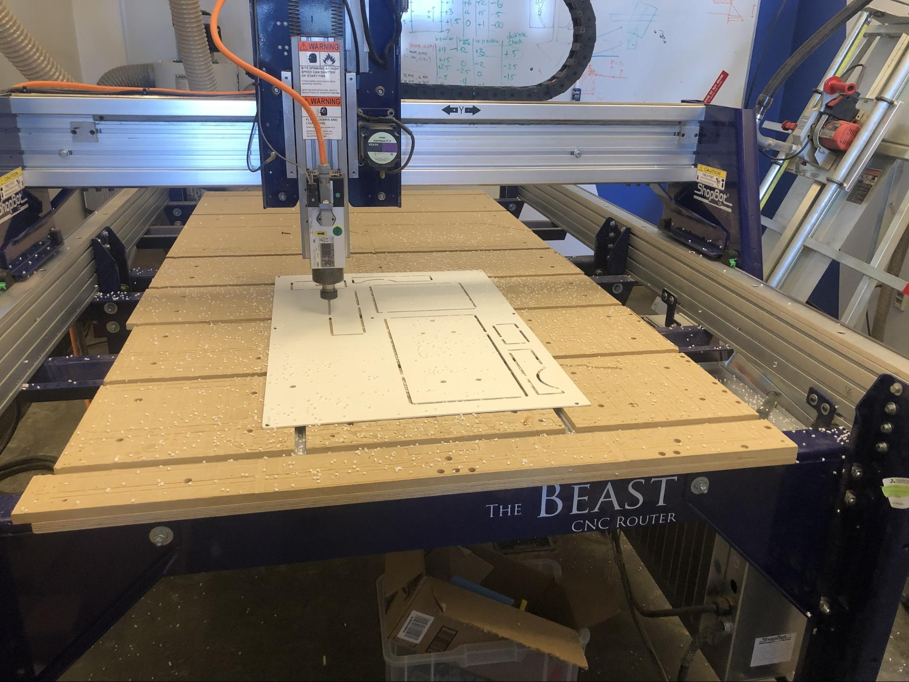
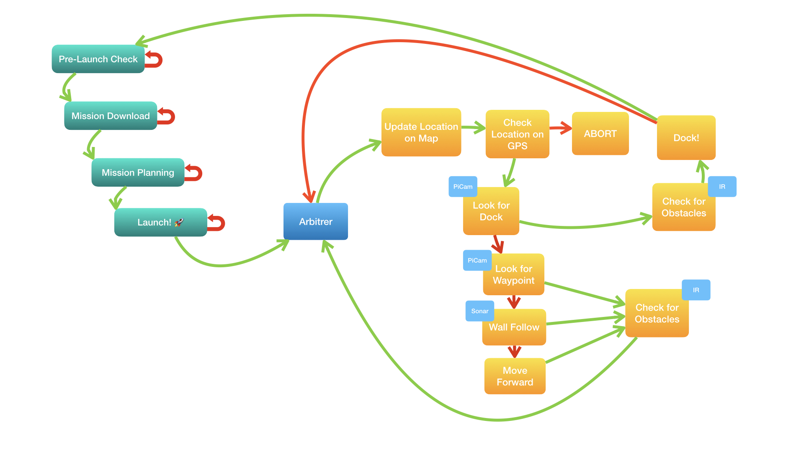

{{}}

### Overview

With a team of 5 other Olin students, I helped built a fully autonomous rover that was capable of driving around campus. The Rover was capable of driving from point to point while preforming obsticle avoidance. The Rover also had a manipulator on the front that was capable of picking up and dropping items. 

The rover navigated using a series of sensors. On the rover were two sonar sensors, five infrared distance sensors, a GPS module, and webcam capable of object recognition. The rover was powered entierly off of a Rasperry Pi and was built using the chassis and motors of a 4WD R-C car. 

The Rover was programmed entierly using MATLAB. 

### Photos and Technical Documentation
Here are several photos of the rover's construction and some of the technical documentation. 

---

#### Rover Construction
Here is our priliminary CAD model of the rover.

{{}}

Here is our prototype model made out of laser cut cardboard.

{{}}

After making a prototype, we decided to make the rover out of Delrin, a sturdy yet easily machinable material. To cut all the parts, we decided to CNC router it.

{{}}

Here are some photos of our front manipulator/claw.

{{}}

 

{{}}

Here is our final rover during a test run.

{{}}

---

#### Electrical Design
Here is an electrical diagram of our rover and power calculations.

{{}}

---

#### Software Design
Check out all our code is on the following [GitHub respository](https://github.com/nabihestefan/OlinRover)

Here is a finite state machine diagram that represents our rover's software process.

{{}}