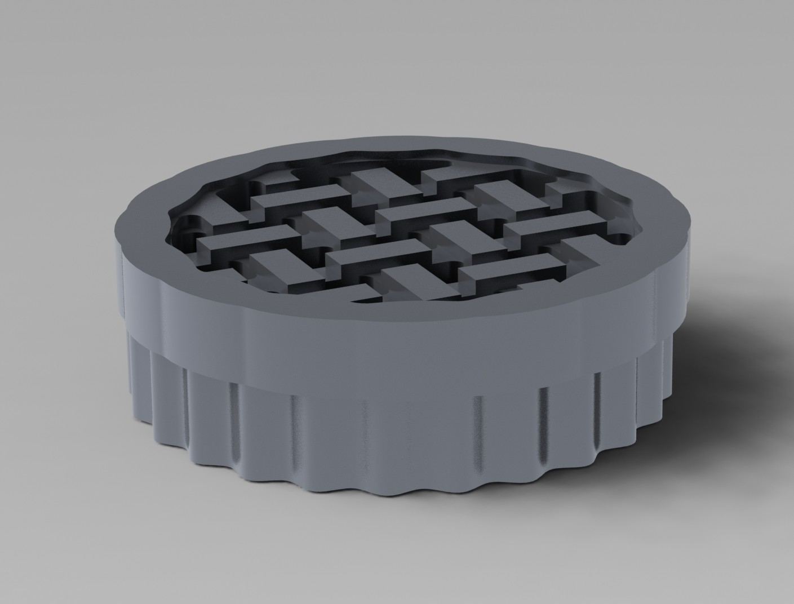
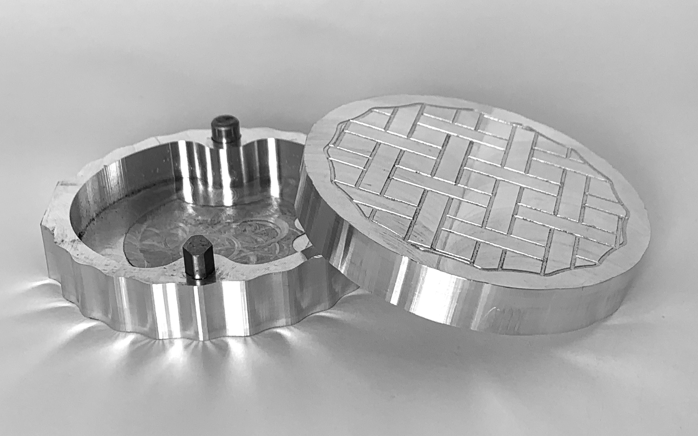
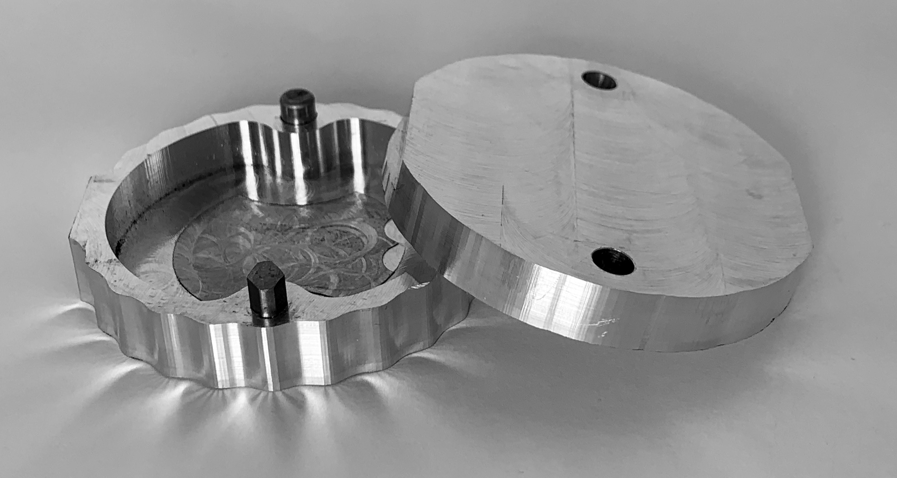
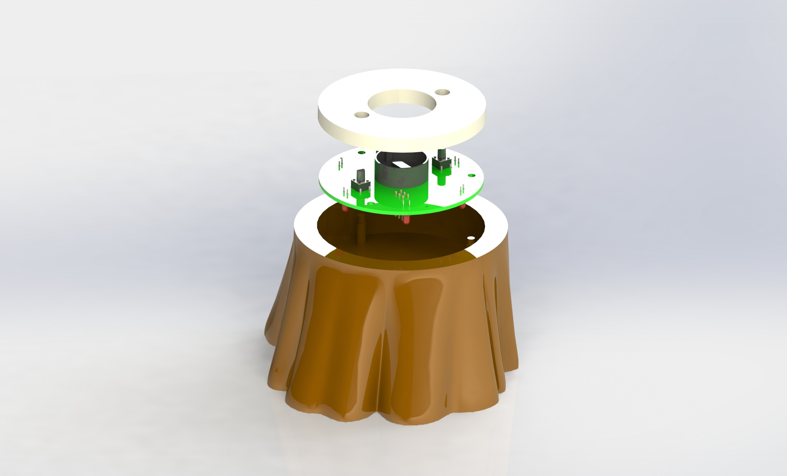
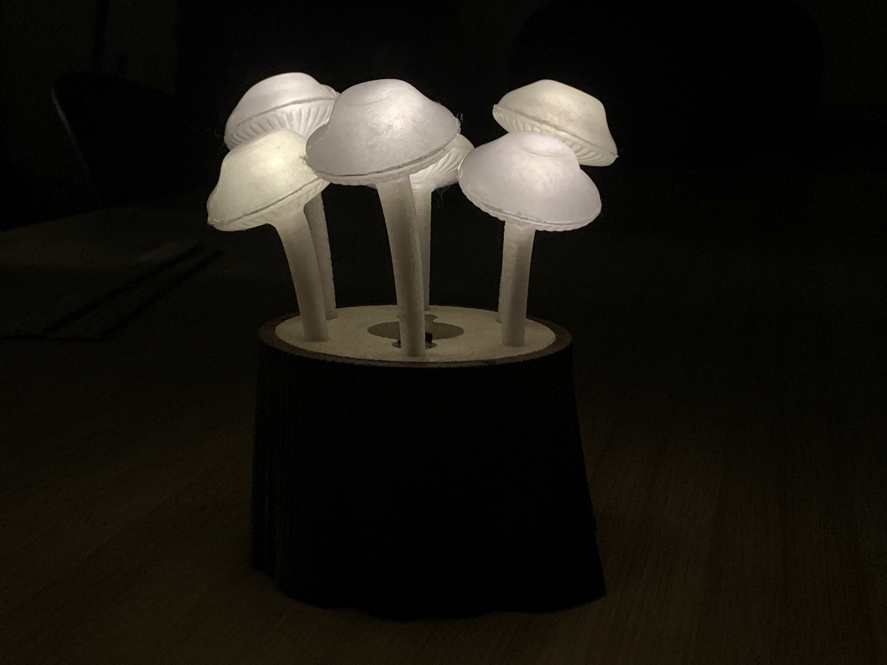
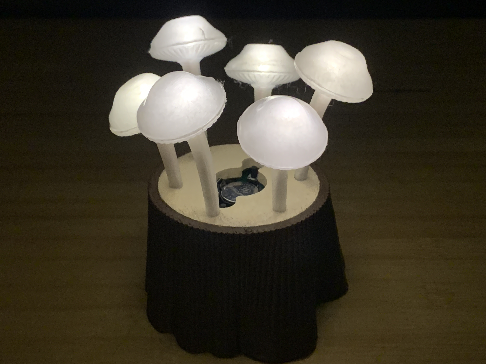

### Treasure Box

The first project that I worked on was designing a "treasure box" that would be machined out of a 6"x6"x3" block of aluminum. The box would be CNC milled using a Tormach mill. I decided that I would try to make my box look like a pie. Here are a few images of the CAD and the final result:

The first design included a full lattice pattern on the top of the box. There was a few problems with this design. First off, the lattice pattern was too complicated and time intensive for CNC milling. Second off, the base of the box wasn't capabile of being calped in a vice. 

The second version of the box reduced the complexity of the top lattice pattern and included flat surfaces on the base of the box so that it could be securely clamped in a vice. 

Here is the final Box!

The box uses a series of pins to locate the lid to the base.

The underside of the lid with holes for the pins in the base.

### Night Light

For my next project, I worked on designing a night light. I was given a PCB that had built-in LEDS and a few buttons to control the lights. However, I had free reign to design the enclosure for the night light. I decided that it would be cool to design the night light as a set of glowing mushrooms that are popping out of a log. This project involved FDM 3D printing, Resin 3D printing, and vacuum forming. Here are a few images of the CAD and the final result:

Here is the initial CAD model of the night light. 

Here is a render showing how the PCB fits into the base of the lamp.

Here is a photo of the final product. The log contains the PCB that controls the lights. The base is 3D printed using a Markforged printer and is painted. The stems of the mushrooms are printed using translucent PLA on a Prusa Mk3 printer. The cap and underside of the mushroom are vacuum formed using molds that were printed on a Formlabs resin 3D printer.

Here is a photo of how the night light look in the dark.

Again, another photo of the lamp in the dark. 