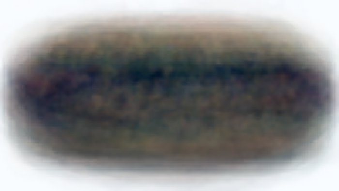
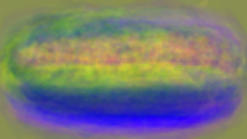
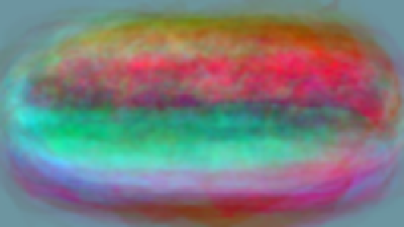
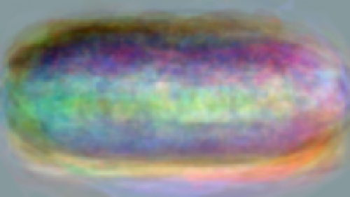
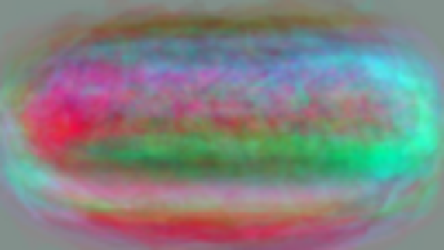
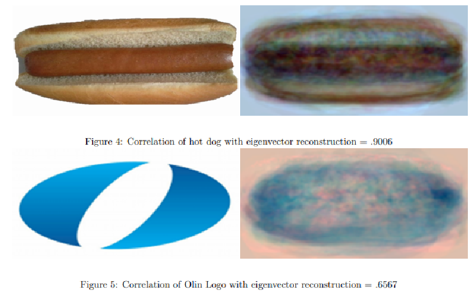

### About

In this project, I created an algorithm that attempted to identify whether an image was a hot dog or not. 

To build this algorithm, I first assembled a training set of 89 images of hot dogs. I then removed the background noise in each photo and re-oriented the hot dog so that it lay horizontal across the center of a 72x128 frame. I then vectorized each photo into a 9216x1x3 matrix (one column vector for each set of RGB value. I then combined the vectorized images into a 9216x89x3 matrix. 

I then took this training set matrix and created a 9216x9216x3 covariance matrix. Using this covariance matrix, I was able to then calculate the eigenvectors for the training data set. This program uses the first 20 principal eigenvectors which represent 20 "building blocks" by which the training set data could be built.

The images below show how I vectorized the training images and created a covarriance matrix out of them. For the sake of displaying the matrix, I am only showing the red sections out of the RGB matrix.

{{}}
{{}}

The images below show the first 5 primary eigenvectors.

{{}}
 
{{}}
 
{{}}
 
{{}}
 
{{}}
 

My algorithm's approach for classifying whether an object was a hot dog or not a hot dog was to take an image of an object and to project it onto the eigenvector space. It then found the correlation between this compressed image and the original image. Images of hot dogs are not changed by a significant margin when they were compressed by eigenvectors, while images of non-hot dogs are deformed by a significant amount.
When the algorithm compares the correlation rate between these two images, if the correlation is above a certain threshold, the program considerers it to be a hot dog.

The image below shows some of the algorithm's findings and demonstrates its viability.

{{}}
---
## Final Report
<iframe src="https://drive.google.com/file/d/1gG6pCWpDNPaFriDvA_YELosfVvA4JW9T/preview" width="100%" height="600" allow="autoplay"></iframe>