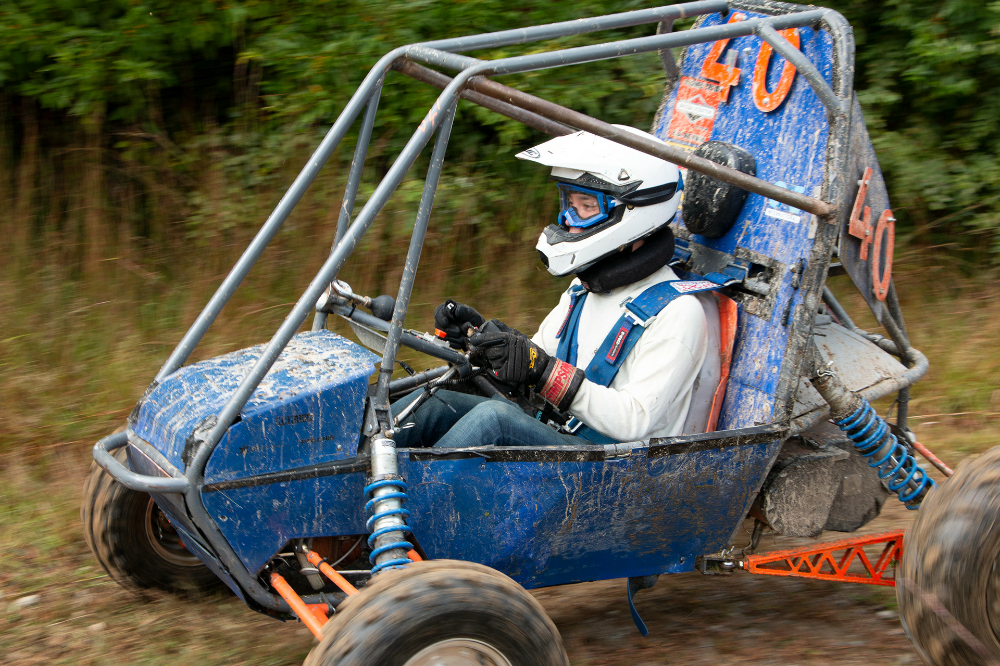

### Overview

I have been a member of Olin's Baja SAE team since my freshman year. The team meets biweekly, during which we work on designing the year's Baja vehicle in preparation for end of year competitions. During our own free time, we work on machining needed parts.
I am on the suspension subteam which is responsible for the front and rear suspensions, front brakes, and steering.
Through Olin's Baja team, I have improved by CAD skills, learned how to preform FEA, and picked up many machining skills. I have also learned a lot about steering geometry and cars in general.

### Year 1

During my first year, I worked on several parts for the front suspension. However, the majority of my time was spent designing the steering knuckle. For those of you who have no clue what a knuckle is, the knuckle is what connects the wheel (via the spindle) to the suspension and steering. 
There are three primary concerns when designing the knuckle. The first is that it needs to be able to sustain all the forces that might occur when driving without deforming. The second concern is ease of manufacturing.  Since we machine the knuckle out of a single block of aluminum, it needs to have a geometry simple enough to be made given our shop's limited capabilities. Lastly, the knuckle needs to be designed so that it serves the proper steering geometry (steering axis inclination, scrub radius, negative camber gain).

Below are CAD images of the knuckle and its placement in the front suspension assembly.

|||
|:-:|:-:|

Below is an image of an FEA simulation I ran on the knuckle. We simulated the forces acting upon the knuckle and spindle if the Baja vehicle were to crash into a tree.

### Year 2

This year on Baja, I am taking upon a larger roll in the design of the front suspension. I am responsible for designing the layout of the front foot-box and the front steering geometry.
This year, the team is moving towards implementing a 4WD system, which involves drastic changes over the previous year's 2WD system. One of the big changes is the front suspension. First off, the front foot-box has more things in it. In previous years, the front foot-box primarily just had the accelerator, brake pedals, and steering rack. Now, the front foot-box is adding the front differential, the prop-shaft, and two half-shafts. All of these things take up vital space in the front foot-box. I am working on fitting all of these components into the foot-box while leaving ample space for the driver's legs.

With a brand new 4WD system, the front geometry has to change significantly. With the addition of the differential and half shaft, I had to rework the entire geometry to make sure that suspension metrics are met. I had to optimize for the following metrics: scrub radius, caster, camber, steering axis inclination, toe, ackerman angle, camber gain with roll, and bump steer. By the end of the year, I was still on optimizing the geometry.

