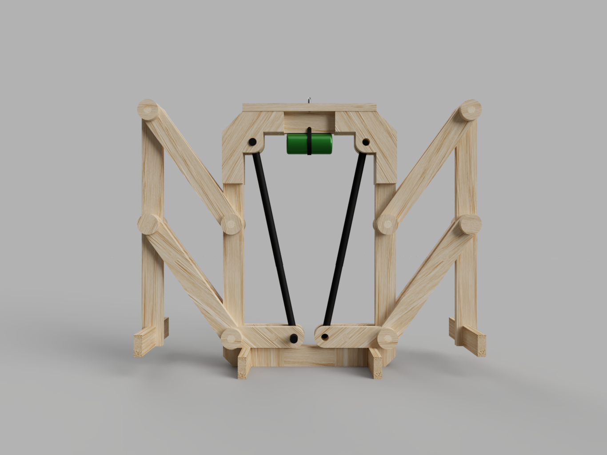
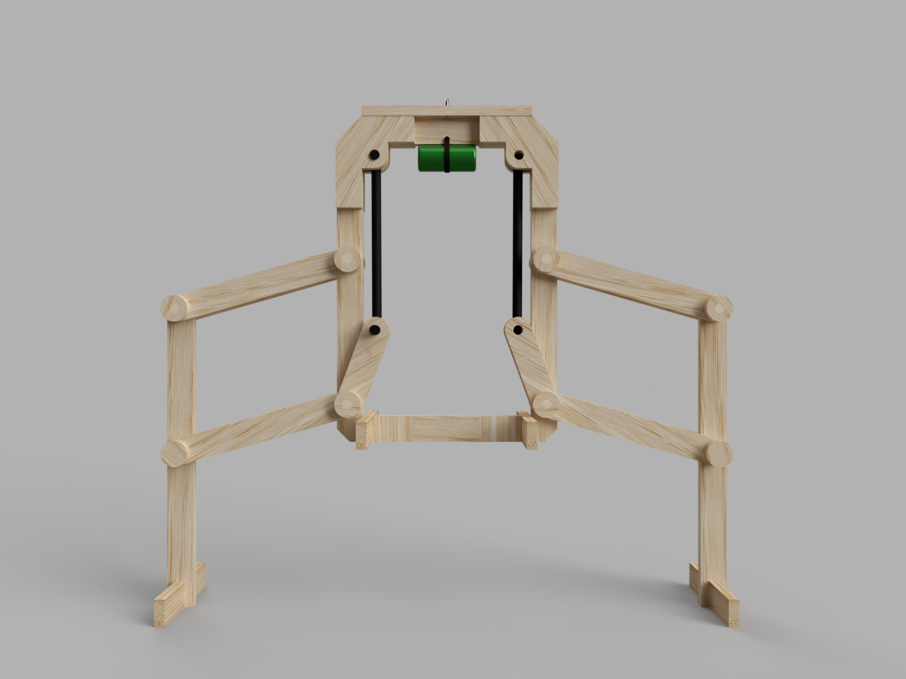
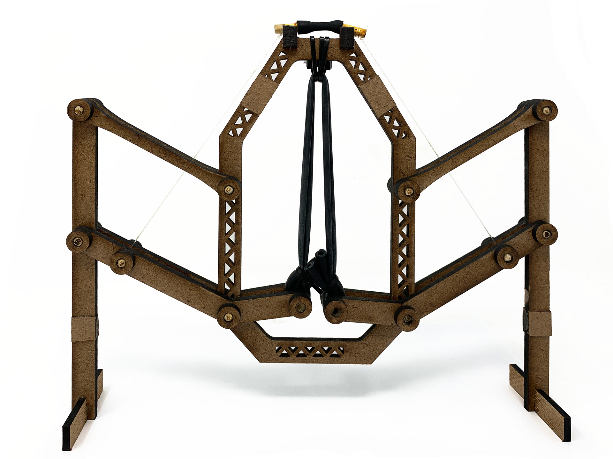
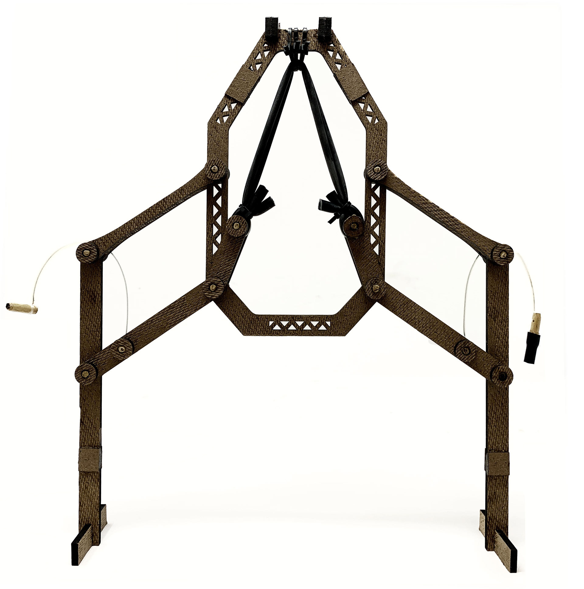

For this project, I designed a "hopper" using a set of limited materials. The aim of this project was to learn more about design process, using CAD, and prototyping.

This was the first drawing of my hopper. I really wanted to incorporate a four-bar linkage as the primary jumping mechanism. I was also inspired by a how a grasshopper shoots it's leg out to jump. These sources of inspiration are what lead me to this design.

This was my first prototype. I built it using cardboard, Popsicle sticks, rubber bands, and tape.

|||
|:-:|:-:|

This was my first CAD design. It kept many of the original design cues from my original sketch. 

|||
|:-:|:-:|

After a few re-designs and some changes to reduce weight, this was my final hopper. It was able to jump around 0.6 meters.
